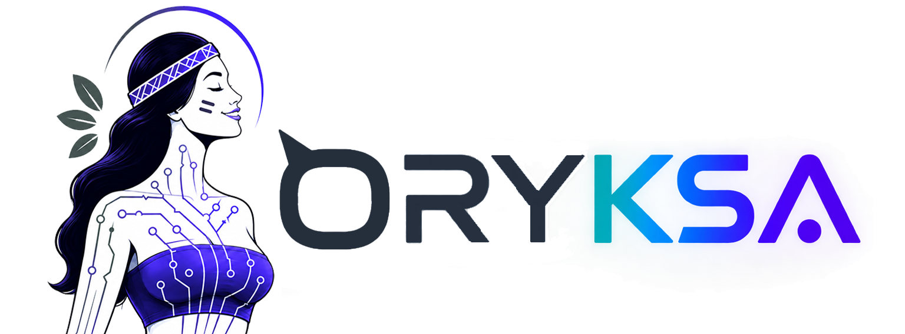
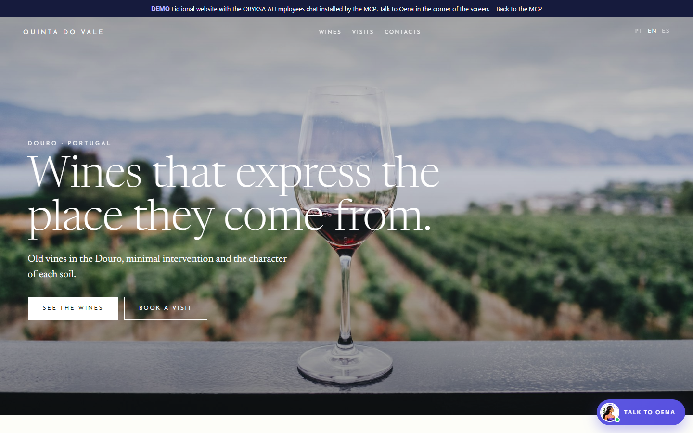
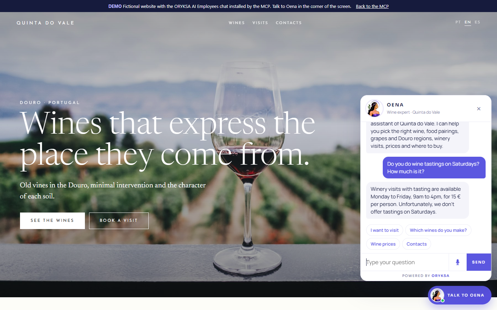
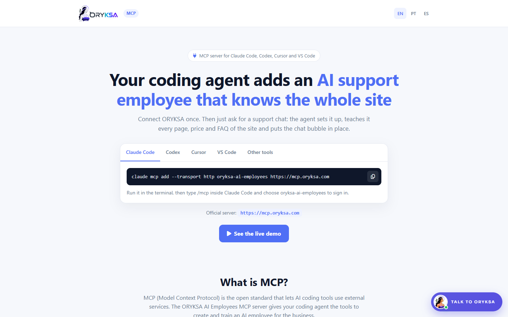

<p align="center"></p>
<p align="center"><a href="https://glama.ai/mcp/connectors/com.oryksa/ai-employees"></a></p>

# ORYKSA AI Employees (MCP server)

Add an AI customer support employee to the website you are building, straight from your AI coding tool.
Your coding agent connects ORYKSA, **teaches the agent the whole site** (pages, prices, FAQ) and installs a
chat that answers visitors with **text and voice**. The same employee also answers your customers on WhatsApp and Telegram.

- **Server URL:** `https://mcp.oryksa.com` (remote, streamable HTTP, OAuth 2.1 sign-in in the browser)
- **Website:** https://mcp.oryksa.com
- **Live demo:** https://mcp.oryksa.com/demo/en
- **Claude connectors directory:** [claude.ai/directory/connectors/oryksa](https://claude.ai/directory/connectors/oryksa)
- **Listed in:** [awesome-remote-mcp-servers](https://github.com/punkpeye/awesome-remote-mcp-servers) · [Glama](https://glama.ai/mcp/connectors/com.oryksa/ai-employees)
- **Developer portal (API, webhooks, SDKs):** https://developer.oryksa.com · SDK: [oryksa/oryksa-js](https://github.com/oryksa/oryksa-js)
- **Official MCP Registry:** [`com.oryksa/ai-employees`](https://registry.modelcontextprotocol.io/v0/servers?search=com.oryksa)

## Live demo

A fictional winery website with the ORYKSA chat installed through the MCP. Open it and talk to the agent by text or voice:
**https://mcp.oryksa.com/demo/en**

[](https://mcp.oryksa.com/demo/en)

The agent answers from what it learned on the site (prices, hours, visits):

[](https://mcp.oryksa.com/demo/en)

[](https://mcp.oryksa.com)

## Install

**Claude Code**
```bash
claude mcp add --transport http oryksa-ai-employees https://mcp.oryksa.com
```
Then type `/mcp` in Claude Code, choose `oryksa-ai-employees` and sign in.

**Claude Code plugin (MCP server + skill)**
```bash
/plugin marketplace add oryksa/oryksa-mcp
/plugin install oryksa-ai-employees@oryksa-ai-employees
```

**Codex** (`~/.codex/config.toml`)
```toml
[mcp_servers.oryksa-ai-employees]
url = "https://mcp.oryksa.com"
```
Then run `codex mcp login oryksa-ai-employees`.

**Cursor** (`.cursor/mcp.json`) / **VS Code** (`.vscode/mcp.json`)
```json
{ "mcpServers": { "oryksa-ai-employees": { "url": "https://mcp.oryksa.com" } } }
```

## Just ask

> Add an AI customer support chat to this site with ORYKSA and teach it everything on the site.

## Tools

| Tool | What it does |
|---|---|
| `oryksa_status` | Account, plan, interactions left, what the agent already knows |
| `oryksa_setup_business` | Business name, services, prices, hours, languages, tone |
| `oryksa_learn_site` | Teaches the agent the visible text of every page of the project |
| `oryksa_learn_from_url` | Reads a live site and writes the business fact sheet |
| `oryksa_add_faq` | Questions and exact answers |
| `oryksa_get_widget_snippet` | Chat code for HTML, Next.js, React, Vue, Nuxt, Astro, Svelte, Angular, WordPress |
| `oryksa_customize_chat` | Agent photo, greeting and quick suggestions |
| `oryksa_set_allowed_domains` | Locks the chat to the site domains |
| `oryksa_test_agent` | Asks the agent real customer questions (free) |
| `oryksa_links` | Dashboard, WhatsApp connection, plans |

## Developer bonus

Accounts connected through the MCP get **+100 interactions per day for the first 30 days**, on top of the Free plan (50 per week), website chat included.

## Security and privacy

Sign in happens in your browser with OAuth; the tool never sees your password. The tools cannot delete the account,
make payments or connect WhatsApp. Privacy policy: https://oryksa.com/en/privacy/#mcp · Contact: info@oryksa.com

## Author

Created by **Weslley Harakawa** · [GitHub](https://github.com/WeslleyHarakawa) · [LinkedIn](https://www.linkedin.com/in/weslleyharakawa)

© ORYKSA AI Employees · W8 Atlantic Unipessoal Lda
